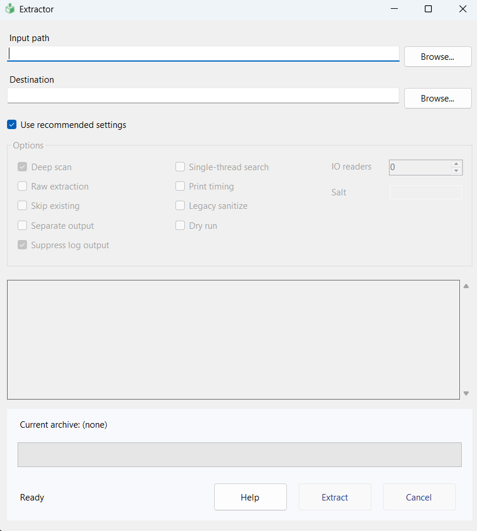

<p align="center">
  
</p>

# Extractor GUI (Windows)
The Extractor now includes a simple Windows GUI built on the same extraction core. It lets you extract .scs archives (HashFS v1/v2) and ZIP files (including "locked" ZIPs) without using the command line.

## How to Use
1. Pick the input (.scs file or a folder with .scs files)
   - Click `Browse...` in the "Input path" field and choose `File` or `Folder`.
   - Or drag and drop a file/folder onto the "Input path" field or the window.
2. Choose the destination
   - The app auto-suggests an output directory:
     - File: `<name>_extracted` next to the `.scs` file.
     - Folder: `<name>_extracted_all` next to the folder.
   - Use `Browse...` next to "Destination" to change it.
3. Recommended profile
   - By default, `Use recommended settings` is enabled. It:
     - Enables `Deep scan` and, when a folder is selected, recommends `Separate output`.
     - Suppresses less-important log lines for clearer status.
     - Keeps other options at safe defaults.
   - Uncheck it to tweak all options manually.
4. Options (1:1 with the CLI)
   - `Deep scan` (`--deep`): searches for referenced paths to discover more files.
   - `Raw extraction` (`--raw`): extracts without additional adjustments/renaming.
   - `Skip existing` (`--skip-existing`): does not overwrite existing files.
   - `Separate output` (`--separate`): when processing multiple `.scs`, creates one subfolder per file.
   - `Single-thread search` (`--single-thread`): single-threaded path search.
   - `Print timing` (`--times`): prints timing information to the log.
   - `Legacy sanitize` (`--legacy-sanitize`): legacy filename sanitization mode.
   - `Dry run` (`--dry-run`): simulates extraction without writing to disk.
   - `IO readers` (`--io-readers=N`): number of parallel I/O readers (0 = automatic).
   - `Salt` (`--salt=N`): numeric value used in specific hash-based name cases.
   - `Suppress log output`: reduces log verbosity (UI behavior only).
5. Run, monitor, and cancel
   - Click `Extract` to start. `Cancel` stops safely.
   - The progress bar and percent indicate progress; "Current archive" shows the active file.
   - The log panel records messages; with `Suppress log output` enabled, only essentials appear.
6. Built-in help
   - `Help` opens a window with quick start, option descriptions, tips, and troubleshooting.

Download the Windows executable from Releases. For command-line usage, see the section below.

# Extractor CLI (Command Line)
A cross-platform .scs extractor for both HashFS and ZIP.

## Features
* Supports HashFS v1 and v2 as well as ZIP (including "locked" ZIP files)
* Can extract multiple archives at once
* Partial extraction
* Raw dumps
* Built-in path-finding mode for HashFS archives without directory listings
* Automatic conversion of 3nK-encoded and encrypted SII files

## Build
A Windows executable is available on the Releases page. On other platforms, install the
.NET 8 SDK and run the following:

```sh
git clone https://github.com/sk-zk/Extractor.git
cd Extractor
dotnet publish -c Release
```

## Usage
```
extractor path... [options]
```

### General Options
<table>
<thead>
  <tr>
    <td><b>Short</b></td>
    <td><b>Long</b></td>
    <td><b>Description</b></td>
  </tr>
</thead>
<tr>
  <td><code>-a</code></td>
  <td><code>--all</code></td>
  <td>Extracts all .scs archives in the specified directory.</td>
  </tr>
<tr>
  <td><code>-d</code></td>
  <td><code>--dest</code></td>
  <td>Sets the output directory. Default: <code>./extracted</code>.</td>
  </tr>
<tr>
  <td></td>
  <td><code>--dry-run</code></td>
  <td>Simulates extraction without writing files to disk.</td>
  </tr>
<tr>
  <td></td>
  <td><code>--list</code></td>
  <td>Lists paths contained in the archive. Can be combined with <code>--deep</code>.</td>
  </tr>
<tr>
  <td></td>
  <td><code>--legacy-sanitize</code></td>
  <td>Use legacy invalid-character replacement (<code>xNN</code> hex per char). Disables whole-name counter renaming.</td>
  </tr>
<tr>
  <td></td>
  <td><code>--list-all</code></td>
  <td>Lists all paths referenced by files in the archive, even if they are not contained in it.
  (Implicitly activates <code>--deep</code>.)</td>
  </tr>
<tr>
  <td><code>-p</code></td>
  <td><code>--partial</code></td>
  <td>Limits extraction to the comma-separated list of files and/or directories specified. Examples:<br>
  <code>-p=/locale</code><br>
  <code>-p=/def,/map</code><br>
  <code>-p=/def/world/road.sii</code><br>
  When extracting a HashFS archive (without <code>--deep</code>), directory traversal begins at the given paths, allowing for
  extraction of known directories and files not discoverable from the top level. In all other cases, extraction is limited to
  files whose paths begin with any of the strings given to this parameter.
  </td>
  </tr>
<tr>
  <td><code>-P</code></td>
  <td><code>--paths</code></td>
  <td>Same as <code>--partial</code>, but expects a text file containing paths to extract, separated by line breaks.</td>
  </tr>
<tr>
  <td><code>-S</code></td>
  <td><code>--separate</code></td>
  <td>When extracting multiple archives, extract each archive to a separate directory.</td>
  </tr>
<tr>
  <td><code>-s</code></td>
  <td><code>--skip-existing</code></td>
  <td>Don't overwrite existing files.</td>
  </tr>
<tr>
  <td></td>
  <td><code>--tree</code></td>
  <td>Prints the directory tree and exits. Can be combined with <code>--deep</code>, <code>--partial</code>, <code>--paths</code>, and <code>--all</code>.</td>
  </tr>
<tr>
  <td><code>-?</code>, <code>-h</code></td>
  <td><code>--help</code></td>
  <td>Prints the extractor's version and usage information.</td>
  </tr>
</table>

### HashFS Options
<table>
<thead>
  <tr>
    <td><b>Short</b></td>
    <td><b>Long</b></td>
    <td><b>Description</b></td>
  </tr>
</thead>
<tr>
  <td></td>
  <td><code>--additional</code></td>
  <td>When using <code>--deep</code>, specifies additional start paths to search. Expects a text file containing paths to extract, separated by line breaks.</td>
  </tr>
<tr>
  <td><code>-D</code></td>
  <td><code>--deep</code></td>
  <td>Scans contained entries for referenced paths instead of traversing from <code>/</code>. Use this to extract archives without a top-level directory listing.</td>
  </tr>
<tr>
  <td></td>
  <td><code>--single-thread</code></td>
  <td>When using <code>--deep</code>, forces single-threaded path search (slower, legacy behavior). Default: multi-threaded.</td>
  </tr>
<tr>
  <td></td>
  <td><code>--list-entries</code></td>
  <td>Lists entries contained in the archive.</td>
  </tr>
<tr>
  <td><code>-r</code></td>
  <td><code>--raw</code></td>
  <td>Directly dumps the contained files with their hashed filenames rather than traversing
  the archive's directory tree.</td>
  </tr>
<tr>
  <td></td>
  <td><code>--salt</code></td>
  <td>Ignores the salt in the archive header and uses the given one instead.</td>
  </tr>
<tr>
  <td></td>
  <td><code>--table-at-end</code></td>
  <td>[v1 only] Ignores what the archive header says and reads the entry table from
  the end of the file.</td>
  </tr>
</table>

### Examples
Normal extraction:
```
extractor "path\to\file.scs"
```

Extract two .scs files at once:
```
extractor "path\to\file1.scs" "path\to\file2.scs"
```

Extract all .scs files in a directory:
```
extractor "path\to\directory" --all
```

Extract `def` and `manifest.sii` only:
```
extractor "path\to\file.scs" -p=/def,/manifest.sii
```

Extract with deep mode:
```
extractor "path\to\file.scs" --deep
```

Extract with deep mode when the mod is split into multiple archives:
```
extractor "file1.scs" "file2.scs" "file3.scs" --deep --separate
```

Alternatively:
```
extractor "path\to\mod\directory" --all --deep --separate
```

## Performance Options
- <code>--times</code>: Print stage timing summary.
- <code>--benchmark</code>: Deep-scan benchmark (HashFS, dry-run; single vs multi-thread).
- <code>--single-thread</code>: Single-threaded deep search (HashFS).
- <code>--io-readers=N</code>: Number of parallel readers for IO/decompression. Applies only to HashFS with <code>--deep</code>. Default: logical CPU count; set <code>N=0</code> to auto.

